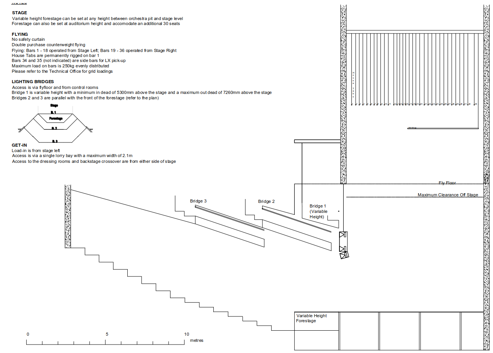
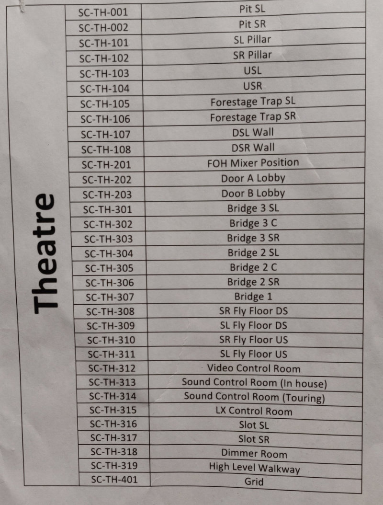

# WAC Theatre
The WAC Theatre is our largest performance space, seating up to 575 people. In term 2, we will typically have a show 
here by Warwick Opera and Music Theatre Warwick.

## Layout & Seating

### 360 Camera View
The WAC provides a 360 view of all its venues on its
[website](https://www.warwickartscentre.co.uk/our-venues/studio/).
<iframe src="https://my.matterport.com/show/?m=gyBcoRB4m7u&play=1&qs=1&hl=0&brand=0&sr=-.26,.39&ss=706" width="100%" height="600" ></iframe>

### Seating

## Working in the Space

As with any venue in the Warwick Arts Centre, it is important to be mindful and respectful of other users. For those
working on a show, the studio can be accessed via Back of House - the code to access this changes weekly and can be
given on request to Tech Crew exec.

When getting out, please follow the WAC's
[get out checklist](https://drive.google.com/file/d/1V3--hqdy2GujzzLPbnORoPKkkl1umAva/view?usp=sharing).

## Technical Specifications
### Patch Panels

A [list of all the patch panel numbers](https://drive.google.com/file/d/1me_DVrEaxsSUcurCd-MGxp_9FndEu_dc/view?usp=sharing)
can be found on the wall in the sound control room, next to the patching rack. Make sure to make a note of the patching
before changing anything, so this can be reverted during the get-out.

When patching, use the black patch cables stored on the ducting next to the rack. Red patch cables should never be
touched (where possible) - if you need to change these, make sure to revert them back during the get-out.

Note that unless patched, patches with a red label will automatically link to the matching red label patch below it.

Commonly used patch panels are:
| Name | Location | Sound (XLR) | Data (Ethernet) | Video | Power |
|------|----------|-------|-----------------|-------|-------|
| SC-TH-001 | Pit SL | 1-12 | ? | ? | ? |
| SC-TH-002 | Pit SR | 1-12 | ? | ? | ? |
| SC-TH-101 | SL Pillar | 1-12 | ? | ? | ? |
| SC-TH-102 | SR Pillar | 1-12 | ? | ? | ? |
| SC-TH-103 | USL | 1-12 | ? | ? | ? |
| SC-TH-104 | USR | 1-12 | ? | ? | ? |
| SC-TH-105 | Stage Trap SL | 1-2 | ? | ? | ? |
| SC-TH-106 | Stage Trap SR | 1-2 | ? | ? | ? |
| SC-TH-107 | DSL Wall | 1-4 | ? | ? | ? |
| SC-TH-108 | DSR Wall | 1-4 | ? | ? | ? |
| SC-TH-201 | FoH Mixing Position | 1-48 (Input), 1-12 (Output) | ? | ? | ? |
| SC-TH-301 | Bridge 3 SL | 1-2 | ? | ? | ? |
| SC-TH-302 | Bridge 3 C | 1-2 | ? | ? | ? |
| SC-TH-303 | Bridge 3 SR | 1-2 | ? | ? | ? |
| SC-TH-304 | Bridge 2 SL | 1-2 | ? | ? | ? |
| SC-TH-305 | Bridge 2 C | 1-4 | ? | ? | ? |
| SC-TH-306 | Bridge 2 SR | 1-2 | ? | ? | ? |
| SC-TH-307 | Bridge 1 (Movable) | 1-6 | ? | ? | ? |
| SC-TH-313 | Sound Control Room | 1-48 (Input), 1-24 (Output) | ? | ? | ? |
| SC-TH-315 | LX Control Room | 1-4 | ? | ? | ? |

Note that e.g. USL stands for Upstage Left, DSC stands for Downstage Center and SR stands for Stage Right.

When using the Front of House mixing position (SC-ST-201), you will also need to unplug the sound multipin snake from
the sound control room (SC-ST-313).